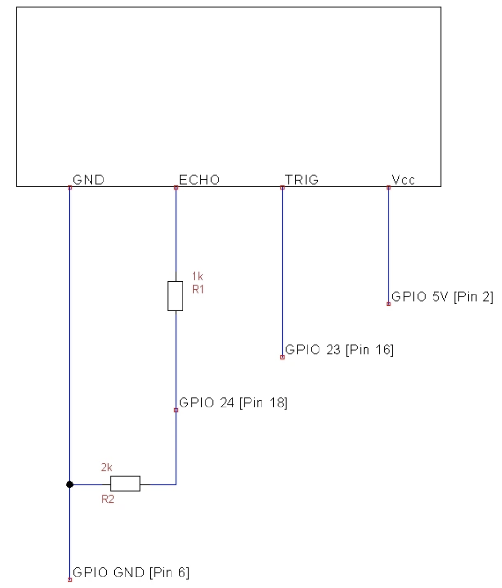

### Connected Ultrasonic Smart Trashcan
Smart Trashcan for Cumulocity IoT as seen at IoT World 2019. This is utilizing a HR-SC04 ultrasonic sensor on Raspberry Pi on the Cumulocity IoT Platform 

### Prerequisites

Pre-requisites:
- Python (tested on Python 3.6+)
- 'json', 'requests', 'paho-mqtt' packages installed (e.g. pip install xxx)
- Cumulocity tenant with Basic Authentication 
- HR-SC04 Ultrasonic Connector hooked to Raspberry Pi using 

### Hardware  
You need the following components:
- Breadboard
- HC-SR04 Sensor
- 1kΩ Resistor
- 2kΩ Resistor
- Jumper Wires

The HC-SR04 ultrasonic distance sensor's voltage needs to be regulated from 5V to 3.3V to prevent damage to your hardware. Wire the ultrasonic sensor based on the following circut below:
 

### Script Modifications:
Open the smartTrash.py script, and modify the following:

URL, clientID, tenantID, username, password.

Client ID should be unique per device (if you plan on creating multiple devices)

### Running

- Run the python script though your console, ensuring the Python environment and required packages are available in the path.

```
	>> python ./smartTrash.py
```

This should automatically trigger device creation in Cumulocity and the distance measurements on the python console should start being posted under the measurements tab under device management application for your specific device. You can then start creating a dashboard and apama analytics rules to further built on this demo. 
